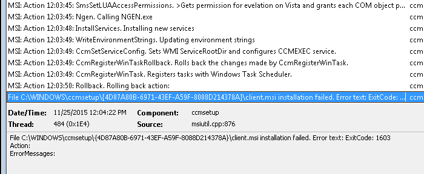
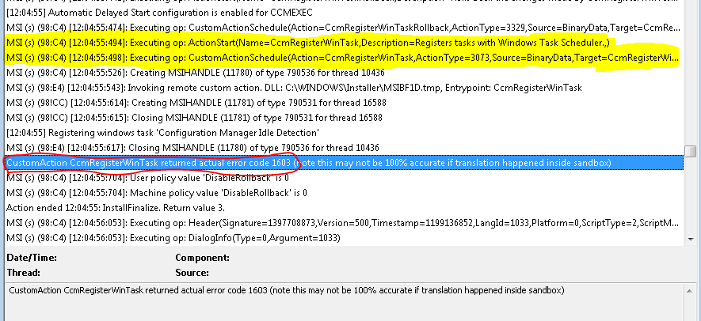

It has been a busy couple of weeks at work, I spent a couple of weeks travelling to remote sites for some project work. When I got back I had to on on-call week to keep me busy right before the Thanksgiving holiday. It was one of those weeks that would make you pull your hair out, I don't have any so i survived. Nothing complicated or real interesting but I just spent the week doing the same things over and over. Most of the time it was repairing the SCCM clients so the helpdesk could install code or remote control the system.

**Tip - it pays to read the logs**
I had numerous clients failing to install or repair due to a error 1603 being returned from the client.msi

So this is not uncommon and is sometimes caused by wmi or pending actions from other installs. So I start with the standard steps - reboot and try again. Same result, so lets check wim with `winmgmt /verifyrepository`  everything reports ok aka "WMI repository is consistent". Ok, lets re-register the msiexec service: remove with `msiexec /unregister` install with `msiexec /regserver`. Done now lets try again; Dang, same error.  Ok, now I have to read the log file. The client.msi.log has the error "CustomAction CcmRegisterWinTask returned actual error code 1603". 

A search for the error leads me to [https://social.technet.microsoft.com/forums/en-US/42cc3f5c-dbe4-4406-8eea-9a9aab4f2acf/sccm-2012-clientmsi-fails](https://social.technet.microsoft.com/forums/en-US/42cc3f5c-dbe4-4406-8eea-9a9aab4f2acf/sccm-2012-clientmsi-fails) which shows the resolution is to reset the task scheduler service to automatic and start it before installing the client. I added that to my standard checks for when the client install fails and found several more with the same issue. At least, I can quickly fix the client now to find out what is changing the service configuration.
